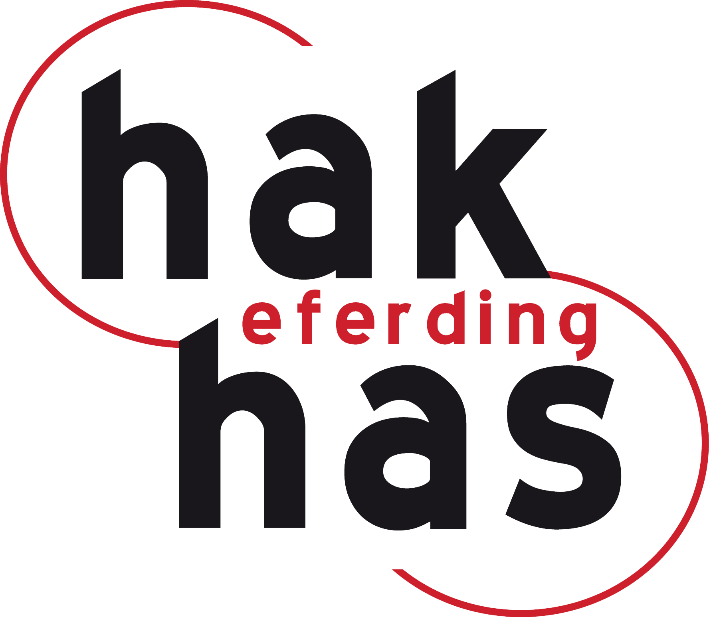
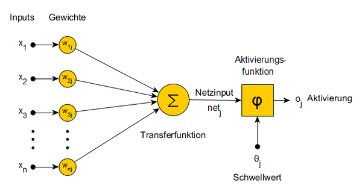
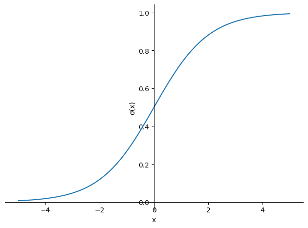
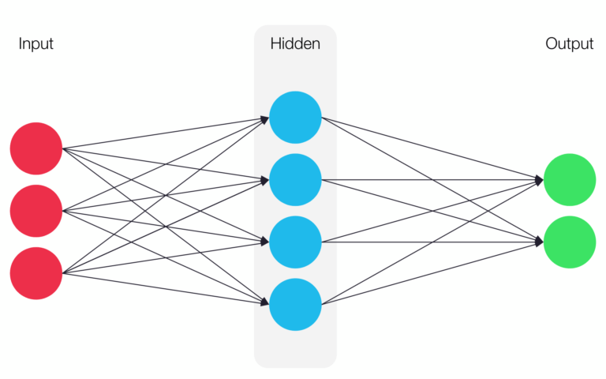
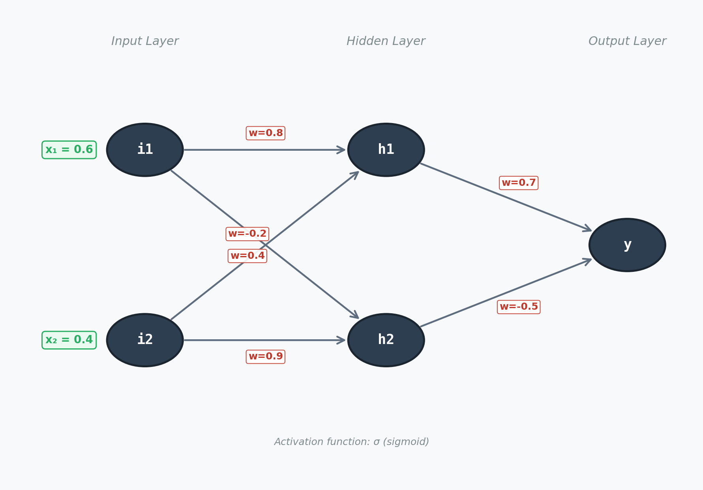
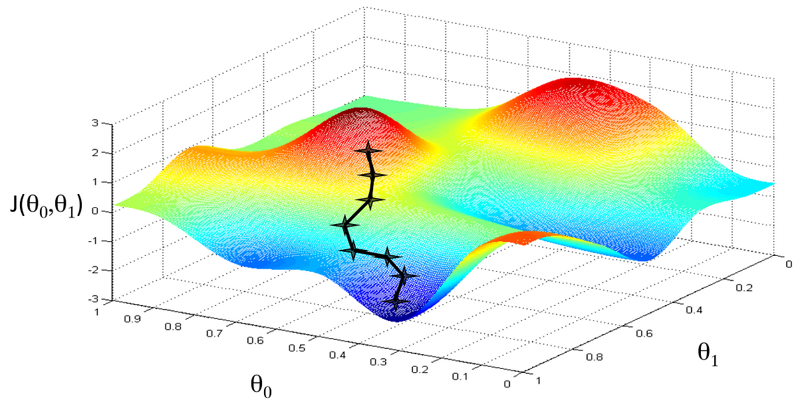
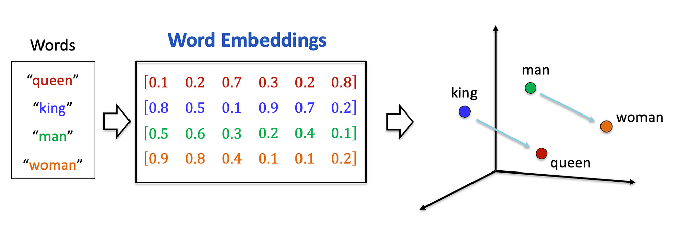
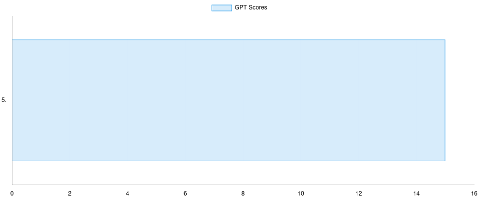
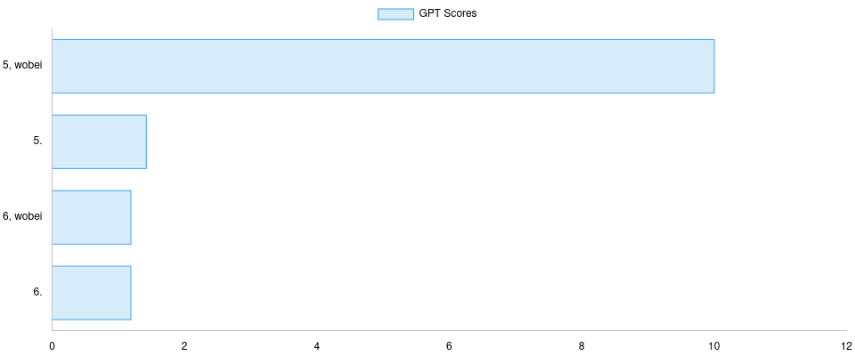
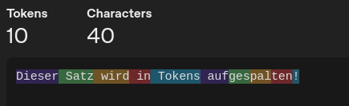

# KI und Mathematik

Alexander Kornfellner

----

### Inhalte
- Was ist Künstliche Intelligenz (KI)?
- Neuronale Netze
- Vector Embedding
- Large Language Models (LLMs)
- Prompting

----

# Was ist KI?

----

- Der Begriff "Künstliche Intelligenz" wurde 1956 von John McCarthy geprägt; wichtige Vorarbeiten leistete Alan Turing (1950).
- KI ist ein Teilgebiet der Informatik, das darauf abzielt, Systeme zu entwickeln, die Aufgaben übernehmen können, die normalerweise menschliche Intelligenz erfordern — z. B. Lernen, Planen, Schlussfolgern und Problemlösen.
- Wichtige Teilgebiete: Robotik, Expertensysteme, Sprach- und Textverarbeitung (NLP), Computer Vision, Machine Learning (ML) und Deep Learning (DL).

----

----

### Artificial Intelligence (AI)

- KI umfasst alle Technologien und Methoden, die darauf abzielen, Maschinen menschenähnliche Intelligenz zu verleihen.
- sehr vage Definition
- was ist "Intelligenz"?

----

### Machine Learning (ML)

- Computer entwickelt Algorithmen nicht nach festen Regeln, sondern durch das Erkennen von Mustern in Daten.
- Einfaches Beispiel: **Lineare Regression**

----

### Deep Learning (DL)

- Teilgebiet des Machine Learnings, das auf künstlichen **neuronalen Netzen** basiert.

---

# Neuronale Netze

----

### Anwendungen

- Bild- und Spracherkennung
- Natürliche Sprachverarbeitung (NLP)
- Empfehlungssysteme
- LLMs (z.B. ChatGPT)
- ...

----

### Inspiration

- Biologische Neuronen im menschlichen Gehirn

----

### Künstliches Neuron

Quelle: <a href="https://methpsy.elearning.psych.tu-dresden.de/mediawiki/index.php/Neuronale_Netze" target="_blank" rel="noopener">TU Dresden</a>

----

### Mathematik im Neuron

- Gewichtete Summe
- Aktivierungsfunktion
- nicht **linear**

$$
\text{Output} = \sigma\left(\sum_{i=1}^{n} w_i \cdot x_i\right)
$$

----

### Aktivierungsfunktion

- durch Aktivierungsfunktionen kann Linearität verhindert werden
- bringt meinen Output in ein vorgegebenes Intervall
- Es gibt verschiedene:
  - Sigmoid
  - ReLU
  - Softmax
  - ...

----

#### Beispiel Sigmoid Funktion

$$
\sigma(x) = \frac{1}{1 + e^{-x}}
$$

----

### Aufbau eines Neuronalen Netzes

- besteht aus mehreren Schichten (Layers)
- Kanten verbinden die Neuronen der Schichten und haben Gewichte
- Jede Schicht besteht aus mehreren Neuronen

----

### Aufbau eines Neuronalen Netzes

Quelle: <a href="https://nativdigital.com/neuronale-netze/" target="_blank" rel="noopener">https://nativdigital.com/neuronale-netze/</a>

----

### Beispiel zum händischen Rechnen

*Hinweis: Gozintograph*

----

### Lösung

- $h1 = \sigma\left(0{,}8\cdot 0{,}6 + (-0{,}2) \cdot 0{,}4\right)= \frac{1}{1+e^{-0{,}4}}=0{,}5987$
- $h2 = \sigma\left(0{,}4\cdot 0{,}6 + 0{,}9 \cdot 0{,}4\right)= \frac{1}{1+e^{-0{,}6}}=0{,}6457$
- $y = \sigma\left(0{,}7 \cdot 0{,}5987 + (-0{,}5) \cdot 0{,}6457\right)=\mathbf{0{,}524}$

----

### Elegantere Schreibweise mit Matrizen

$$
\mathbf{h} = \sigma\left(\mathbf{W_1} \cdot \mathbf{x}\right)
$$

- Demo Matrizenrechnung

----

### Vorteile Matrizenrechnung

- kompakter
- effizienter zu berechnen (v.a. bei großen Netzen)
- einfacher zu implementieren
- parallelisierbar (GPU)

----

### Anmerkungen zu Neuronalen Netzen

- Gewichte werden zufällig (meist normalverteilt) initialisiert
- Trainingsprozess passt die Gewichte an
- Neuronales Netz ist eine große, komplexe, nicht-lineare Funktion, die von vielen Variablen (Gewichte) abhängt
- GPT-3 hat z.B. ca. 175 Milliarden Gewichte in 96 Schichten

----

#### Wie lernen Neuronale Netze (Training)?

- Trainingsdaten: Eingabedaten + erwartete Ausgabe (Label)
- Vorhersage der Ausgabe durch das Netz
- Berechnung des Fehlers (Loss Function)
- Anpassung der Gewichte durch Backpropagation und Optimierungsverfahren (z.B. Gradient Descent)

----

### Backpropagation

- Fehler wird rückwärts durch das Netz propagiert
- anteilige Anpassung der Gewichte basierend auf ihrem Beitrag zum Fehler
- kann wieder mit Matrizenrechnung effizient berechnet und dargestellt werden mit den transponierten Matrizen der Gewichte

----

### Backpropagation

- Fehlerfunktion, z.B. mittlere quadratische Abweichung (MSE): $L=(\text{Soll} - \text{Ist})^2$
- Wie trägt ein Gewicht $w$ zum Fehler bei?
- partiellen Ableitung der Fehlerfunktion nach $w$ berechnen: $\frac{\partial }{\partial w}$
- Gewicht anpassen: $w = w - \alpha \cdot \frac{\partial L}{\partial w}$
- $\alpha$ = Lernrate

----

### Gradient Descent

- Optimierungsalgorithmus zur Minimierung der Fehlerfunktion
- Gewichte werden in Richtung des steilsten Abstiegs (negativer Gradient) der Fehlerfunktion angepasst
- Iterativer Prozess: viele Durchläufe (Epochen) über die Trainingsdaten
- Lernrate $\alpha$ bestimmt die Schrittgröße bei der Anpassung der Gewichte

----

### Gradient Descent

Quelle: <a href="https://medium.com/@jaleeladejumo/gradient-descent-from-scratch-batch-gradient-descent-stochastic-gradient-descent-and-mini-batch-def681187473" target="_blank" rel="noopener">https://medium.com/@jaleeladejumo/gradient-descent-from-scratch-batch-gradient-descent-stochastic-gradient-descent-and-mini-batch-def681187473</a>

----

### händisches Beispiel

$L = (t-o)^2 \text{ und } o = \sigma(w_1 \cdot h_1 + w_2 \cdot h_2)$

$\Rightarrow L = (t - \sigma(w_1 \cdot h_1 + w_2 \cdot h_2))^2$

$\mathbf{\frac{\partial L}{\partial w_1} = -2(t-o) \cdot o \cdot (1 - o) \cdot h_1}$

----

#### konkrete Zahlen

$\alpha = 0{,}1$

$w=0{,}5+0.1\cdot (1-0{,}5938)\cdot 0{,}5938\cdot (1-0{,}5938)\cdot 0{,}4$
$w=0{,}5039$

----

### Moderne Netzarten

- Convolutional Neural Networks (CNNs) — Bildverarbeitung
- Recurrent Neural Networks (RNNs) — Sequenzdaten
- Long Short-Term Memory (LSTM) — Langzeitabhängigkeiten
- Transformer — NLP, LLMs (z.B. GPT-5, BERT)

----

### Mathematik in Neuronalen Netzen

- Lineare Algebra (Matrizenrechnung)
- Analysis (Ableitungen, Kettenregel, Aktivierungsfunktionen)
- Optimierung (Gradient Descent)
- Normalverteilung (Gewichtinitialisierung, Skalierung)

---

# Vector Embedding

----

### Was ist Vector Embedding?

- Umwandlung von Objekten (Wörter, Sätze, Bilder) in Vektoren in einem hochdimensionalen Raum
- Ziel: semantische Ähnlichkeiten und Beziehungen zwischen Objekten erfassen
- Grundlage für viele KI-Anwendungen, z.B. NLP, Bildverarbeitung, Empfehlungssystem
- Beispiel: Netflix, Spotify...

----

Quelle: <a href="https://medium.com/a-intelligence/understanding-text-to-vector-representation-from-tokenization-to-embeddings-b59dfdabbbae" target="_blank" rel="noopener">https://medium.com/a-intelligence/understanding-text-to-vector-representation-from-tokenization-to-embeddings-b59dfdabbbae</a>

### Demo: TensorFlow Embedding Projector

<a href="https://projector.tensorflow.org/" target="_blank" rel="noopener">Demo</a>

----

### Ähnlichkeiten

- Vektoren können verglichen werden, um Ähnlichkeiten zu messen
- Metriken:
  - Euklidische Distanz (Abstand)
  - Manhattan-Distanz (Abstand)
  - Kosinus-Ähnlichkeit (Winkel zwischen Vektoren)
  - Skalarprodukt, wenn Vektoren normiert sind

----

### Zusammenhänge und Distanzen

- Mann zu Frau wie König zu _______?
- Vater zu Mutter wie Bruder zu _______?
- Paris zu Frankreich wie Berlin zu _______?

---

# Large Language Models (LLMs)

----

### Was sind LLMs?

- Große neuronale Netze, die auf riesigen Textdatenmengen trainiert wurden
- Ziel: Verständnis und Generierung natürlicher Sprache
- Beispiele: ChatGPT, Gemini, Claude, Llama...

<a href="https://www.youtube.com/watch?v=LPZh9BOjkQs&list=PLZHQObOWTQDNU6R1_67000Dx_ZCJB-3pi&index=5" target="_blank" rel="noopener">Video</a>

----

### Wie funktionieren LLMs?

- Basieren auf Transformer-Architektur
- Lernen komplexe Sprachmuster, Grammatik und Kontext
- **Trainiert durch Vorhersage des nächsten Wortes in einem Satz**

*Meine Lieblingsfarbe ist _____*

----

### Frühere Textvervollständiger

- Beispiel Smartphone: Ich - bin - in - einer - Gruppe - mit - den - anderen - Kindern - die - sich - um - mich - gekümmert - hat - ...
- Problem: Kontext wird nicht gut erfasst, lange Abhängigkeiten schwer zu lernen
- LLMs können längere Kontexte besser verstehen und nutzen

----

### 🧠 Was ist ein Transformer?

Ein **Transformer** ist eine spezielle Art von KI-Modell, die besonders gut darin ist, **Sprache zu verstehen und zu erzeugen**. Seit 2017 bildet diese Architektur die Grundlage fast aller modernen LLMs.

----

## 🔑 Die wichtigsten Ideen dahinter

----

### Attention – das Herzstück

Stell dir vor, du liest einen Satz und möchtest verstehen, worauf sich ein bestimmtes Wort bezieht. Der Transformer macht das auch – mit einem Mechanismus namens **Attention**.

* Attention bedeutet: *„Achte mehr auf die wichtigen Wörter, weniger auf die unwichtigen.“*
* So kann das Modell Zusammenhänge erkennen, egal wie lang der Satz ist.

----

#### Beispiel:
Im Satz *„Das ist mein Lieblingslied von Queen.“* muss das Modell verstehen, dass *„Queen“* sich auf die Band bezieht, nicht auf eine Königin.

----

### Parallel statt nacheinander

* Frühere Modelle (RNNs, LSTMs) mussten Wörter **nacheinander** verarbeiten.
* Transformer können viele Wörter **parallel** betrachten → viel schneller & effizienter.

----

### 🚀 Warum Transformer so erfolgreich sind

* ✔ **Verstehen langen Kontextes** durch Attention
* ✔ **Skalierbar** (funktioniert gut mit riesigen Datenmengen und großen Modellen)
* ✔ **Parallelisierbar** → viel schneller trainierbar
* ✔ **Flexibel**: für Texte, Bilder, Audio, Code usw.

----

### Training von LLMs

- Es besteht aus einem tiefen neuronalen Netz mit Millionen bis Milliarden von Parametern
- Trainiert auf riesigen Textkorpora (Bücher, Artikel, Webseiten)
- Trainiert auf Bildern mit Bildbeschreibungen (Multimodal Models)
- Menschen helfen durch Korrekturen (Reinforcement Learning with Human Feedback, RLHF)

----

### Halluzinationen

- LLMs können falsche oder erfundene Informationen generieren
- Ursachen:
  - Unvollständige oder fehlerhafte Trainingsdaten
  - Veraltetes Wissen (Cutoff-Datum)
  - basiert auf Wahrscheinlichkeiten, nicht Fakten
- **Lösung**: Faktenprüfung, Internetzugang, Deep Research, RAG

----

### Unterschiedliche Antworten

- Warum geben LLMs unterschiedliche Antworten auf dieselbe Frage?
- Beispiel: "Vervollständige den Satz: Das Notensystem geht von 1 bis ..."

----

Quelle: <a href="https://bildungsinformatik.at/2024/collective-gpt/" target="_blank" rel="noopener">https://bildungsinformatik.at/2024/collective-gpt/</a>

----

Quelle: <a href="https://bildungsinformatik.at/2024/collective-gpt/" target="_blank" rel="noopener">https://bildungsinformatik.at/2024/collective-gpt/</a>

----

### Temperatur

- immer das wahrscheinlichste Wort auswählen
  - deterministisch, immer gleiche Antwort
  - kann zu langweiligen Antworten führen
- Temperatur regelt Zufälligkeit:
  - **0**: Keine = blau, blau, blau, blau, ...
  - **1**: Hohe Zufälligkeit = blau, grün, rot, gelb, ...
  - **2**: Sehr hohe Zufälligkeit = Elefant, Auto, grün, 42, jklö, ...
- Standardtemperatur meist zwischen 0,6 und 0,8

----

### Tokens

- LLMs verarbeiten keine Wörter, sondern **Tokens**
- Token können ganze Wörter, Wortteile oder einzelne Zeichen sein

Quelle: <a href="https://platform.openai.com/tokenizer" target="_blank" rel="noopener">https://platform.openai.com/tokenizer</a>

----

### Play around wih different LLMs

- LMArena: https://lmarena.ai/
- Duck.AI: https://duckduckgo.com

----

### Chatbots

- LLMs sind keine Chatbots
- Chatbots sind Anwendungen, die auf LLMs aufbauen
- Chatbots haben oft zusätzliche Funktionen:

---

# Prompting

----

### Prompt Engineering

- **Prompt**: Eingabeaufforderung oder Frage an eine Generative KI
- **Prompt Engineering**: Kunst und Wissenschaft, effektive Prompts zu erstellen, um gewünschte Ergebnisse von KI-Modellen zu erhalten

----

### Prompting Techniken

- Es gibt viele Techniken, um bessere Prompts zu erstellen
- nicht für alle Aufgaben gleich gut geeignet
- viele davon sind logisch und intuitiv

----

### Präzise Sprache

- Chatbots sind keine Suchmaschinen
- ganze Sätze und menschliche Sprache verwenden
- strukturierte Anfragen stellen
- Abkürzungen vermeiden
- nichts voraussetzen

----

### Rolle zuweisen

- Weise dem Modell eine Rolle zu, um den Kontext zu setzen
  - Ansatz 1 - Experte: "Du bist ein erfahrener Mathematiklehrer..."
  - Ansatz 2 - Charakter: "Du bist Albert Einstein..."
  - Ansatz 3 - Zielgruppe: "Gib mir Rückmeldung aus der Sicht eines 16 jährigen Schülers der Handelsakademie"

----

### Kontext bereitstellen

- KI kann keine Gedanken lesen
- so viele relevante Informationen wie möglich bereitstellen
- Orientierung an W-Fragen möglich: Wer? Was? Wann? Wo? Warum? Wie?
- Beispiel: "Erstelle eine 4-wöchige Unterrichtssequenz für den Mathe-Unterricht zum Thema Integralrechnung.” Zu viel Spielraum: Wie viele Stunden stehen tatsächlich zur Verfügung. 4 x 1 x 45 Minuten, oder 4 x 3 x 50 Minuten?

----

### Beispiele geben

- Beispiele helfen dem Modell, den gewünschten Stil und das Format zu verstehen
- Beispiel: "Erstelle ein Arbeitsblatt zum Thema XY für mich. Achte bei Komplexität und Umfang auf folgendes Beispiel, ändere aber die Angabe"

----

### Retrieval Augmented Generation (RAG)

- Kombiniert LLMs mit externen Wissensquellen
- Modell greift auf Dokumente, Datenbanken oder das Internet zu, um Antworten zu generieren
- Vorteile:
  - Aktuelles Wissen
  - Reduzierte Halluzinationen
- Beispiel: Ehemalige Zentralmatura-PDFs als Wissensbasis hochladen um bei der Erstellung neuer Aufgaben im typischen Stil zu bleiben

----

### Rückfragen

- Fordere das Modell auf, Rückfragen zu stellen, wenn Informationen fehlen
- Beispiel: "Erstelle eine Stundenwiederholung zum Thema XY. Frage bitte zuerst nach allen Informationen die du brauchst, damit du mir bestmöglich helfen kannst."

----

### Vorlagen erstellen

- Erstelle Vorlagen für wiederkehrende Aufgaben
- Wenn ein Prompt gut funktioniert, speichere ihn für zukünftige Verwendung

----

### Nach dem Prompt

- Überprüfe die Antwort kritisch
- Fordere bei Bedarf Verbesserungen an
- Iteratives Vorgehen: "Verbessere die Antwort, indem du ... berücksichtigst"

----

### System Prompts

- Einige Plattformen erlauben spezielle System Prompts
- Setzen den Rahmen für alle folgenden Interaktionen
- Beispiel: "Du bist ein hilfsbereiter Assistent, der immer höflich und professionell antwortet."
- In den User Einstellungen von ChatGPT können eigene System Prompts definiert werden
- Custom GPTs

----

### Tipps

- Experimentiere mit verschiedenen Formulierungen
- Prompting ist Übungssache
- [Markdown](https://www.markdownguide.org/) oder **LaTeX** verwenden